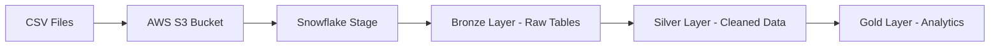

## 📋 Overview
This project implements a complete end-to-end data engineering pipeline for Airbnb data using modern cloud technologies. The solution demonstrates best practices in data warehousing, transformation, and analytics using Snowflake, dbt (Data Build Tool), and AWS.

The pipeline processes Airbnb listings, bookings, and hosts data through a medallion architecture (Bronze → Silver → Gold), implementing incremental loading, slowly changing dimensions (SCD Type 2), and creating analytics-ready datasets.

## 🏗️ Architecture

### 🔁 Data Pipeline Flow

